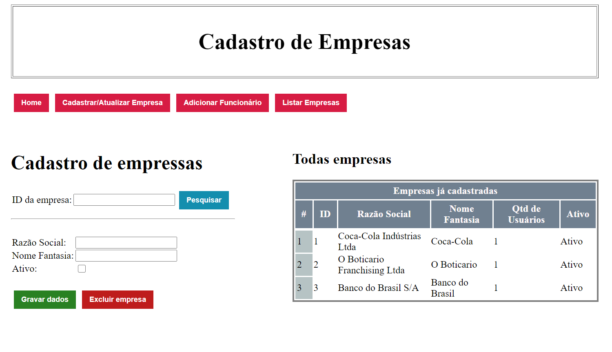
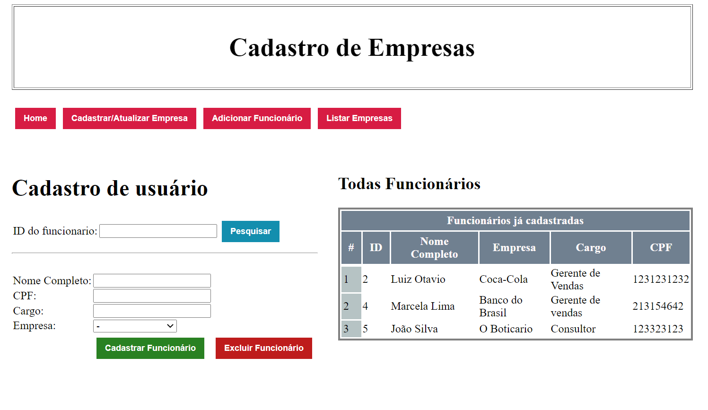

# Registro de Empresas

### É um sistema que consiste no cadastro de empresas e seus funcionários

---
Informações do Projeto:
- Foi usado o servidor WildFly na versão 19 (Java EE & Web Distribution) para o deploy da aplicação
- Foi implementado usando: JavaEE8, JPA, JSF2.3, MySql e um pouco de Javascript
- Foi configurado um datasource no Wildfly e vinculado ele no arquivo <b>persistence.xml</b> para comunicar com o DB
---

OBS: Mudar linha de persistence.xml para:

``
<properties>
<property name="javax.persistence.schema-generation.database.action" value="update"/>
``

#### Tela de cadastro das empresas

#### Tela de cadastro de funcionarios

🎉🙌